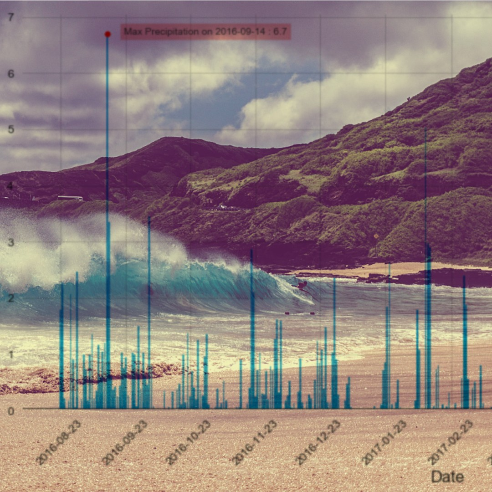
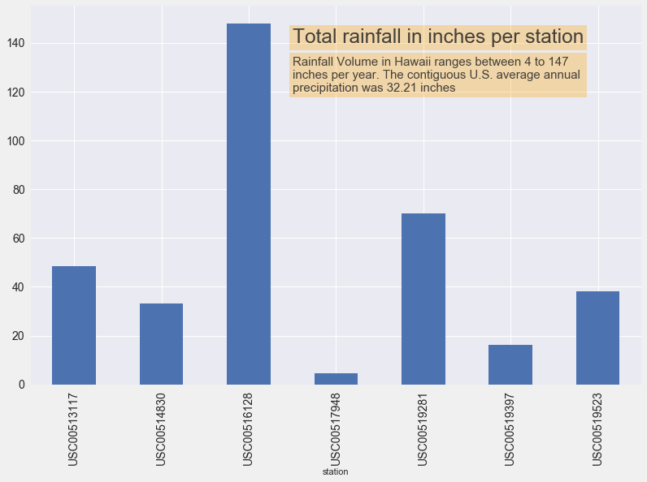
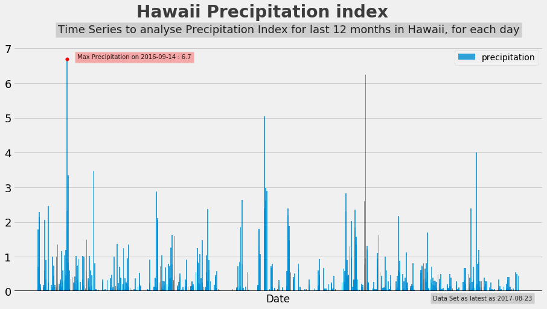

# Planning to visit Hawaii? Let the data help you get excited

### You've saved up for a grand trip to Hawaii, mentally prepared for this vacation of a lifetime and its all going accoerding to plan. Too bad a sudden rainstorm has other ideas, and ends up making you the person to die a bit inside when everyone around you raves about how magical their trip to Hawaii turned out to be. Oh, and lets not begin with how your wallet will dispise you for this.

Now that I have your attention, let me calm things down. Dont worry, Hawaii is NEVER that bad so the worst of it is still quite enjoyable. But its important to look at the data being the weather patterns of the area to help you prepare/plan for your visit. 

## How much does it rain per year?

### Dont be surprised with rainfall variability - 

Hawaii has a tropical climate with average summer temperate at 88F and winter temperature around at 76F. Being close to the tropics, Hawaii gets a large total volume of rainfall per year but because of its equatorial nature and size, at a certain time, you may face pleasant moderating surfing weather or heavy rain storms straight out of Blade Runner. 

Different locations of Hawaii(each station recorded its own dataset) varied largely in precipitation which ranged from 4 inches to 147 inches per year. From high slopes, mountaneous region to low lying islands, there is a drastic variability in geography. Add to that, this data records rainfall between August 2016-August 2017. Its important to note that 2016-17 were La Niña years. La Niña, a phenomenon in the Pacific that causes colder ocean temperatures and lasts about a year and a half and occurs during late fall into early winter. This phenomenon cause variability in rainfall that different regions of Hawaii recieve per year. Depending on which are you are visiting, you can expect to experience heavy showers if you go outdoors towards the slopes or somewhere close to Honolulu Observatory.

## What about the months for rainfall? 

### September, October, February, April, and July have the most rainfall with higher peaks(precipitation > 3.5 inches). June the driest month.

Hawaii's rainy season ranges from September to May, though there isnt a "conventional rainy season" because the island gets burst of rainfall over the year period. the maximum rainfall over the time period of the dataset was on 14th September 2016, though the month of september was one of the wettest with most number of days having rainfall over 2 inches.

