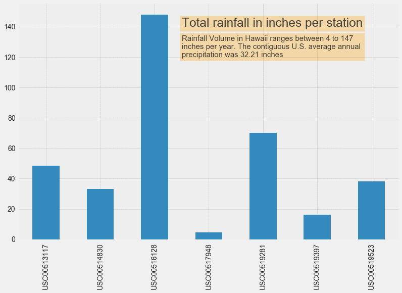
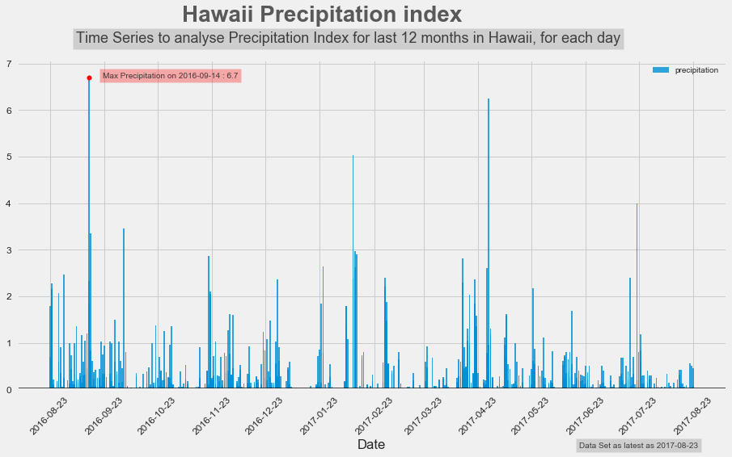
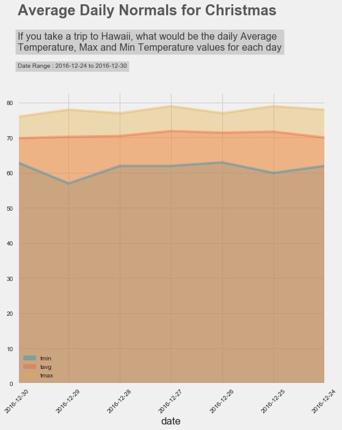

# Planning to visit Hawaii? Let the data help you get excited

### You've saved up for a grand trip to Hawaii, mentally prepared for this vacation of a lifetime and its all going accoerding to plan. Too bad a sudden rainstorm has other ideas, and ends up making you the person to die a bit inside when everyone around you raves about how magical their trip to Hawaii turned out to be. Oh, and lets not begin with how your wallet will dispise you for this.

Now that I have your attention, let me calm things down. Dont worry, Hawaii is NEVER that bad so the worst of it is still quite enjoyable. But its important to look at the data being the weather patterns of the area to help you prepare/plan for your visit. 

## How much does it rain per year?

### Dont be surprised with rainfall variability - 

Hawaii has a tropical climate with average summer temperate at 88F and winter temperature around at 76F. Being close to the tropics, Hawaii gets a large total volume of rainfall per year but because of its equatorial nature and size, at a certain time, you may face pleasant moderating surfing weather or heavy rain storms straight out of Blade Runner. 

Different locations of Hawaii(each station recorded its own dataset) varied largely in precipitation which ranged from 4 inches to 147 inches per year. From high slopes, mountaneous region to low lying islands, there is a drastic variability in geography. Add to that, this data records rainfall between August 2016-August 2017. Its important to note that 2016-17 were La Niña years. La Niña, a phenomenon in the Pacific that causes colder ocean temperatures and lasts about a year and a half and occurs during late fall into early winter. This phenomenon cause variability in rainfall that different regions of Hawaii recieve per year. Depending on which are you are visiting, you can expect to experience heavy showers if you go outdoors towards the slopes or somewhere close to Honolulu Observatory.

## What about the months for rainfall? 

### September, October, February, April, and July have the most rainfall with higher peaks(precipitation > 3.5 inches). June the driest month.

Hawaii's rainy season ranges from September to May, though there isnt a "conventional rainy season" because the island gets burst of rainfall over the year period. the maximum rainfall over the time period of the dataset was on 14th September 2016, though the month of september was one of the wettest with most number of days having rainfall over 2 inches. 

### So does that mean that when its good, its really good and when its bad, its really bad?

We need to ask ourselves if information from rainfall for each month is a good indicator if your trip is going to suffer. Lets take a look at how many fluctuations we have for the precipitation data. 

56% of all the recorded precipitation observations are between 0.05 and 0.00 inches of rain. Out of the rest, 30 percent are approx. 0 inches. That means that over the time period of 12 months, there have been several short outbursts with heavy downpour which cause the volume of total rain per year to go up. This would suggest, that no matter what time you go, you might experience rainfall in some capacity for a short time, and for certain days, a heavy downpour for a short time span too(but its bound to be for a short duration). The variance in geography and large size makes the data on the upper end of rainfall average but that is because of limited high volume rainfall periods. Over last year, there were 2021 precipitation values captured, which means about 5 different precipitation values per day on average. Looking below at the statistics of precipitation data, the mean value is 0.17 inches but its interesting to note that the 75th percentile value is still 0.13. That means most of the days with pleasant precipitation and few ocassions with large downpour. Considering that its the tropics, it rains in some area daily and is cloudy towards the mountains, but fear not because the "bothersome" precipitation values are marginal and you are bound to enjoy sunshine, aside for a short heavy rainfall, if any.

## Thats good, but what about the temperature? 

### Moderate throught the year - 

Hawaii, being a tropical region enjoys a moderate, consistant temperature all year long. There are two seasons -  Summer from May – October and Winter which really should be reffered as "Cool" Summer for the rest of the year. Taking a subset of our dataset, lets look at the station with the most recorded temperature data points so get an estimate of the region.

The result is skewed towards the right which tells us that most of the temeprature values range from 65-80F confirming the consistant moderate temperature in the island all year long. For the 12 month period, the highest temperature was 85°F with a minimum of 54°F. Keep in mind that this dataset was around La Niña, which causes the temperature to fall and during El Niño cycle(reverse of La Niña i.e raises the temperature, causes rainstorms), the temperature is bound to raise by a few degrees. But not enough to make it unpleasant. 

### Three popular vacation periods, how does the temperature differ?

So by now you know what to expect, but still havnt fully decided on the dates. Lets take a look at three popular vacation dates from different months and see how the temperature fares. We will use [LA Times Holiday Period](https://www.latimes.com/travel/deals/la-tr-holiday-travel-20170622-htmlstory.html) to analyze the following three vacation week periods - 

* 4th of July entire week

* Thanksgiving week

* Christmas Week (12/24-12/30)

